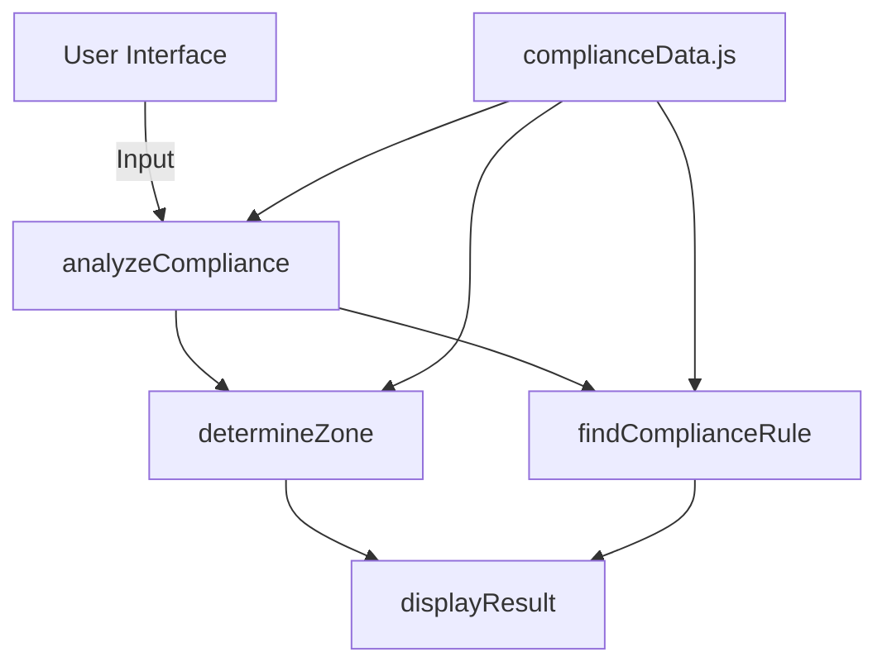

# iCompliance - Regulatory Compliance Research Tool

## Overview
A web-based tool for legal teams to analyze cross-border data transfer compliance requirements between jurisdictions with color-coded results and interactive visualizations.

## Key Features
- Jurisdiction analysis with color-coded results (green/yellow/red)
- Sophisticated SVG microchip loading animations
- Responsive glassmorphism UI design
- Country/region-specific compliance rules
- Service type filtering
- Detailed regulatory references

## Technical Implementation
### Core Technologies
- **Frontend**: Vanilla HTML5, CSS3, JavaScript (ES6+)
- **Styling**: CSS Variables, Grid, Flexbox
- **Animations**: SVG with CSS keyframes

### System Architecture


### Key Components
1. **UI Framework**:
   - Glass card components with backdrop filters
   - Animated cosmic background
   - Responsive layout system

2. **Microchip Animation**:
   - 4-second coordinated animation cycle:
     - 0s: Dots pulse
     - 1s: Lines draw in  
     - 2s: Sparks animate
     - 3s: Waves propagate

3. **Data Structure**:
   ```javascript
   {
       jurisdictions: {region: [countries]},
       countries: {
           countryName: {
               colorCode: "green|yellow|red",
               regulatory: {links, notes},
               states: {stateName: {...}}
           }
       },
       services: {serviceType: {...}}
   }
   ```

## Usage
1. Select client jurisdiction
2. Select provider jurisdiction
3. Choose service type
4. Click "Analyze Compliance"
5. View color-coded results with:
   - Compliance status
   - Regulatory references
   - Detailed explanations

## Development
```bash
# No build required - open directly in browser
open index.html
```

## Future Roadmap
- Gemini AI integration for real-time regulatory updates
- PDF report generation
- Multi-jurisdiction comparison
- User account system
